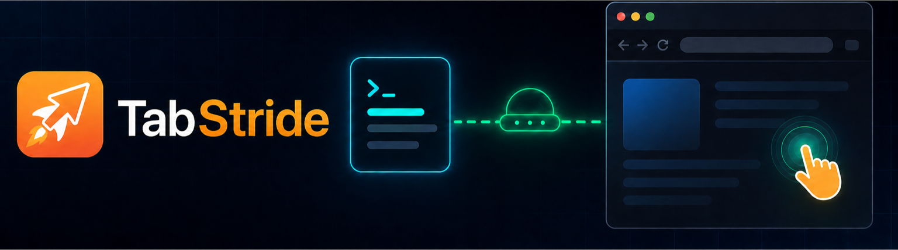
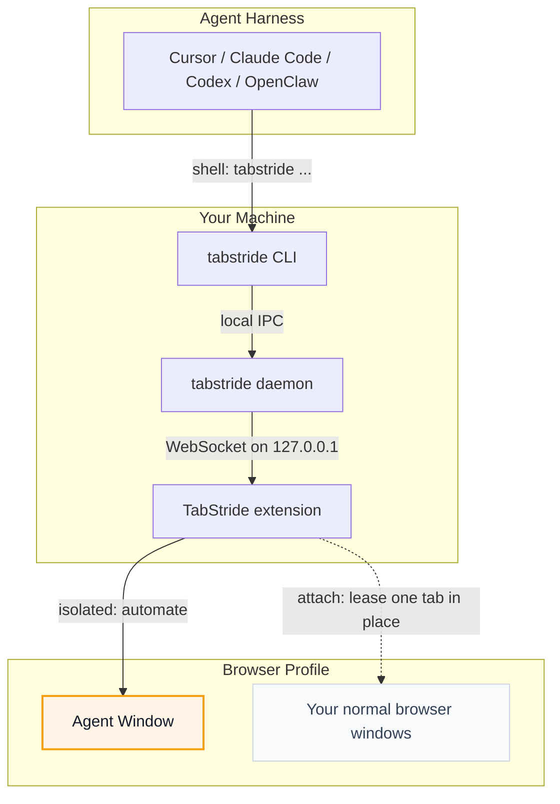

# TabStride

TabStride lets AI test the browser tab you already have open.

<p align="center">
  
</p>

<p align="center">
  <strong>Let AI agents use your browser without interrupting your work.</strong>
</p>

<p align="center">
  English · <a href="README.zh-CN.md">中文</a>
</p>

**TabStride** connects Cursor, Claude Code, Codex, OpenClaw, CodeBuddy, WorkBuddy, Pi, Hermes Agent, and other shell-capable AI agents to your already logged-in browser.

Need the agent to control the current tab in place? Use `tabstride session start --mode attach --tab active`; it creates no window, moves no tab, and leaves sibling tabs inaccessible.


## TabStride Advantages

- **Reuse real login state**: Agents can work with sites you are already signed
  into, without separate test accounts.
- **Two safe modes**: isolated sessions use a separate, visible Agent Window;
  attach sessions lease exactly one explicitly selected existing tab.
- **Support any Agent**: any Agent that can call a shell can use TabStride
  through the `tabstride` CLI, with no lock-in to a specific model, Agent framework, or
  harness.
- **Built-in human-in-loop**: when a task hits captcha, login, confirmation
  dialogs, or other human-only steps, the Agent can ask you to take over and
  then continue afterwards.

## Runtime Environment

TabStride has two local runtime pieces: the `tabstride` CLI/daemon and the browser
extension.

| Runtime | Support |
| --- | --- |
| Operating systems | macOS (Apple Silicon and Intel), Linux (x64 and ARM64), Windows x64 |
| Browsers | Chrome and Microsoft Edge are supported; other Chromium-based browsers are expected to work when they support unpacked Chromium extensions; Firefox is planned |

## Quick Start

<details open>
<summary><b>Install with your Agent (recommended)</b></summary>

<br>

Already using Cursor, Claude Code, Codex, or another shell-capable agent? Just
copy this one line and send it to your agent — it will install the CLI and skill
for you, then walk you through loading the extension:

```text
Set up tabstride on this machine by following https://raw.githubusercontent.com/Tencent/TabStride/main/AGENT_INSTALL.md
```

</details>

<details>
<summary><b>Manual install</b></summary>

<br>

Install the CLI, then install the extension from the [Chrome Web Store](https://chromewebstore.google.com/detail/hhcmgoofomhgciiibhipgmgkgnoenaoi).

#### 1. Install the `tabstride` CLI

**macOS / Linux** (recommended — installs to `~/.local/bin`):

```bash
curl -fsSL https://raw.githubusercontent.com/Tencent/TabStride/main/install.sh | sh
```

**Windows** (PowerShell — installs to `~/.local/bin`):

```powershell
irm https://raw.githubusercontent.com/Tencent/TabStride/main/install.ps1 | iex
```

Verify the binary:

```bash
tabstride --version
```

#### 2. Install the browser extension

Install TabStride from the [Chrome Web Store](https://chromewebstore.google.com/detail/hhcmgoofomhgciiibhipgmgkgnoenaoi).

#### 3. Install the skill

TabStride ships a skill that teaches your agent harness how to use `tabstride`. For
these harnesses, install it in one step:

<p align="center">
<table>
  <tr>
    <td align="center" width="108"><a href="https://cursor.com" title="Cursor"></a><br /><sub><b>Cursor</b></sub></td>
    <td align="center" width="108"><a href="https://docs.anthropic.com/en/docs/claude-code" title="Claude Code"></a><br /><sub><b>Claude Code</b></sub></td>
    <td align="center" width="108"><a href="https://developers.openai.com/codex" title="Codex"></a><br /><sub><b>Codex</b></sub></td>
    <td align="center" width="108"><a href="https://openclaw.ai" title="OpenClaw"></a><br /><sub><b>OpenClaw</b></sub></td>
    <td align="center" width="108"><a href="https://www.codebuddy.ai" title="CodeBuddy"></a><br /><sub><b>CodeBuddy</b></sub></td>
    <td align="center" width="108"><a href="https://www.workbuddy.ai" title="WorkBuddy"></a><br /><sub><b>WorkBuddy</b></sub></td>
    <td align="center" width="108"><a href="https://github.com/badlogic/pi-mono" title="Pi"></a><br /><sub><b>Pi</b></sub></td>
    <td align="center" width="108"><a href="https://github.com/NousResearch/hermes-agent" title="Hermes Agent"></a><br /><sub><b>Hermes Agent</b></sub></td>
  </tr>
</table>
</p>

```bash
tabstride install-skill
```

Use <kbd>Space</kbd> to select the Agent harness you want to install into, then
press <kbd>Enter</kbd> to install the skill. Run `tabstride install-skill --list` to see
internal variants and install paths.

Other shell-capable agent harnesses are supported too. Copy
[`skill/SKILL.md`](skill/SKILL.md) into your harness's skills directory as
`tabstride/SKILL.md` to install the skill manually.

</details>

Start a new Agent session and write a prompt that needs the browser, for example:

```text
/tabstride open example.com and summarize what is on the page.
```

### Run the local service in the foreground

Start the TabStride service explicitly before running browser commands:

```bash
tabstride serve
```

This is the single supported service entrypoint. It starts IPC, WebSocket, session management, and
request processing together, and stops them together when you press <kbd>Ctrl</kbd>+<kbd>C</kbd>.
Use `tabstride serve --help` to configure the WebSocket port or session idle timeout.

Run business commands from another terminal. If the service is absent, they fail immediately and
tell you to run `tabstride serve`; they never create a background process. `tabstride status` and
`tabstride doctor` remain read-only diagnostics and never start the service.

### Choose a session mode

TabStride supports two session modes:

- **Isolated (default)** — `tabstride session start` opens a dedicated Agent Window. Use this when
  the agent should work separately from your current browsing.
- **Attach** — `tabstride session start --mode attach --tab active` leases the active tab in your
  current Chrome window in place. You can also target a known tab with `--tab-id <ID>`.

For example, keep `tabstride serve` running in one terminal and run this lifecycle in another:

```bash
session_id=$(tabstride session start --mode attach --tab active)
tabstride snapshot --session "$session_id"
# navigate, click, fill, and other business commands always use the same session id
tabstride session stop "$session_id"
```

Attach mode controls exactly one existing tab. It does not create a window, move the tab, expose
sibling tabs, or permit tab-management commands such as `tab create`, `tab close`, `tab borrow`,
and `tab return`. Stopping the session detaches browser control and removes the control overlay,
while leaving the user's tab and window open. Always stop the session, including after errors.

### Persistent Agent client

Agent harnesses that can keep a child process alive should use `tabstride client`. It performs one
authenticated WebSocket handshake with `tabstride serve`, then accepts newline-delimited protocol
requests on stdin and writes correlated responses to stdout:

```text
{"id":"start-1","method":"session.start","params":{"mode":"attach","tab":"active"}}
{"id":"snap-1","method":"tool.snapshot","params":{"session_id":"abcd"}}
{"id":"stop-1","method":"session.stop","params":{"session_id":"abcd"}}
```

Requests may be pipelined and cancelled by request id. The connection sends heartbeats, rejects
duplicate in-flight ids, and cleans up requests and sessions it created when the client disconnects.
The `/agent` endpoint listens only on localhost and requires the random capability stored in the
user-only daemon info file; `tabstride client` handles this handshake automatically.

### Batch repeatable work with Flow

Use Flow when the complete sequence is known up front. The CLI validates a YAML file locally, then
submits every step to the service in one `flow.run` request:

```bash
tabstride flow validate examples/flows/todomvc.yaml
tabstride flow run examples/flows/todomvc.yaml --session "$session_id" --var task="write code"
```

Flow v1 supports `navigate`, `click`, `fill`, `press`, `snapshot`, and daemon-side `wait_ms` steps.
Steps run in order through the same session queue as individual CLI commands; the first failure
stops the flow and reports the failed step plus completed-step timings. A total `timeout` and each
tool's `timeout_ms` are independent, and Ctrl+C cancels the active step and the remaining flow.
Targets use exactly one of `css` or `ref`; semantic locators and assertions belong to the next
reliable-execution phase.

Business requests are logged without their payloads:

```text
INFO request started   rpc_id=nav-a1b2 method="tool.navigate" session="abcd" browser="5301f701"
INFO request timing    rpc_id=nav-a1b2 method="tool.navigate" queue_wait_us=81 websocket_us=740 extension_dispatch_us=118420 cdp_us=93470 daemon_runtime_us=119310
INFO request completed rpc_id=nav-a1b2 method="tool.navigate" session="abcd" browser="5301f701" duration_ms=119 total_runtime_us=119508 outcome="ok"
```

Health queries are omitted at INFO level. Form values, page content, selectors, and evaluated
scripts are never included in request logs.
Run `tabstride -v <business-command>` to also print client-side `cli_startup_us`,
`daemon_check_us`, `ipc_connect_us`, and `total_runtime_us`. Timings use microseconds so local IPC
stages below one millisecond remain visible.

## How It Works

TabStride is a local bridge between your agent harness and your browser.



The agent never talks to the browser directly. It asks the `tabstride` CLI to perform a
browser task; the local daemon routes that request to the extension; the
extension runs it in an Agent Window by default, or controls one explicitly
leased existing tab in place when the session uses attach mode.

## For Developers

The repository is a Cargo + pnpm workspace:

- `crates/tabstride-cli` — `tabstride` CLI and local daemon
- `crates/tabstride-protocol` — shared wire types and JSON schemas
- `apps/extension` — browser extension
- `packages/ui` and `packages/i18n` — shared extension UI support

## License

MIT
