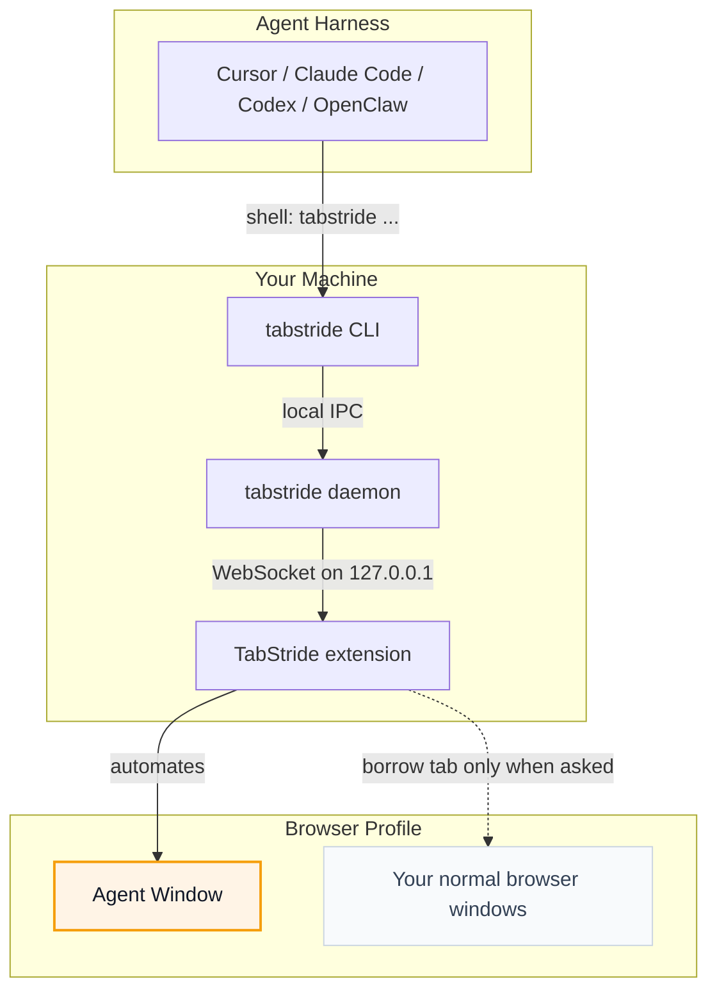

# TabStride

TabStride lets AI test the browser tab you already have open.

<p align="center">
  
</p>

<p align="center">
  <strong>Let AI agents use your browser without interrupting your work.</strong>
</p>

<p align="center">
  English · <a href="README.zh-CN.md">中文</a>
</p>

**TabStride** connects Cursor, Claude Code, Codex, OpenClaw, CodeBuddy, WorkBuddy, Pi, Hermes Agent, and other shell-capable AI agents to your already logged-in browser.

Need the agent to touch a tab you already have open? It must borrow that tab explicitly, return it when the task is done, and leave the rest of your browser alone.


## TabStride Advantages

- **Reuse real login state**: Agents can work with sites you are already signed
  into, without separate test accounts.
- **Keep working uninterrupted**: browser tasks run in a separate, visible
  Agent Window, so you can keep using your own browser.
- **Support any Agent**: any Agent that can call a shell can use TabStride
  through the `tabstride` CLI, with no lock-in to a specific model, Agent framework, or
  harness.
- **Built-in human-in-loop**: when a task hits captcha, login, confirmation
  dialogs, or other human-only steps, the Agent can ask you to take over and
  then continue afterwards.

## Runtime Environment

TabStride has two local runtime pieces: the `tabstride` CLI/daemon and the browser
extension.

| Runtime | Support |
| --- | --- |
| Operating systems | macOS (Apple Silicon and Intel), Linux (x64 and ARM64), Windows x64 |
| Browsers | Chrome and Microsoft Edge are supported; other Chromium-based browsers are expected to work when they support unpacked Chromium extensions; Firefox is planned |

## Quick Start

<details open>
<summary><b>Install with your Agent (recommended)</b></summary>

<br>

Already using Cursor, Claude Code, Codex, or another shell-capable agent? Just
copy this one line and send it to your agent — it will install the CLI and skill
for you, then walk you through loading the extension:

```text
Set up tabstride on this machine by following https://raw.githubusercontent.com/Tencent/TabStride/main/AGENT_INSTALL.md
```

</details>

<details>
<summary><b>Manual install</b></summary>

<br>

Install the CLI, then install the extension from the [Chrome Web Store](https://chromewebstore.google.com/detail/hhcmgoofomhgciiibhipgmgkgnoenaoi).

#### 1. Install the `tabstride` CLI

**macOS / Linux** (recommended — installs to `~/.local/bin`):

```bash
curl -fsSL https://raw.githubusercontent.com/Tencent/TabStride/main/install.sh | sh
```

**Windows** (PowerShell — installs to `~/.local/bin`):

```powershell
irm https://raw.githubusercontent.com/Tencent/TabStride/main/install.ps1 | iex
```

Verify the binary:

```bash
tabstride --version
```

#### 2. Install the browser extension

Install TabStride from the [Chrome Web Store](https://chromewebstore.google.com/detail/hhcmgoofomhgciiibhipgmgkgnoenaoi).

#### 3. Install the skill

TabStride ships a skill that teaches your agent harness how to use `tabstride`. For
these harnesses, install it in one step:

<p align="center">
<table>
  <tr>
    <td align="center" width="108"><a href="https://cursor.com" title="Cursor"></a><br /><sub><b>Cursor</b></sub></td>
    <td align="center" width="108"><a href="https://docs.anthropic.com/en/docs/claude-code" title="Claude Code"></a><br /><sub><b>Claude Code</b></sub></td>
    <td align="center" width="108"><a href="https://developers.openai.com/codex" title="Codex"></a><br /><sub><b>Codex</b></sub></td>
    <td align="center" width="108"><a href="https://openclaw.ai" title="OpenClaw"></a><br /><sub><b>OpenClaw</b></sub></td>
    <td align="center" width="108"><a href="https://www.codebuddy.ai" title="CodeBuddy"></a><br /><sub><b>CodeBuddy</b></sub></td>
    <td align="center" width="108"><a href="https://www.workbuddy.ai" title="WorkBuddy"></a><br /><sub><b>WorkBuddy</b></sub></td>
    <td align="center" width="108"><a href="https://github.com/badlogic/pi-mono" title="Pi"></a><br /><sub><b>Pi</b></sub></td>
    <td align="center" width="108"><a href="https://github.com/NousResearch/hermes-agent" title="Hermes Agent"></a><br /><sub><b>Hermes Agent</b></sub></td>
  </tr>
</table>
</p>

```bash
tabstride install-skill
```

Use <kbd>Space</kbd> to select the Agent harness you want to install into, then
press <kbd>Enter</kbd> to install the skill. Run `tabstride install-skill --list` to see
internal variants and install paths.

Other shell-capable agent harnesses are supported too. Copy
[`skill/SKILL.md`](skill/SKILL.md) into your harness's skills directory as
`tabstride/SKILL.md` to install the skill manually.

</details>

Start a new Agent session and write a prompt that needs the browser, for example:

```text
/tabstride open example.com and summarize what is on the page.
```

## How It Works

TabStride is a local bridge between your agent harness and your browser.



The agent never talks to the browser directly. It asks the `tabstride` CLI to perform a
browser task; the local daemon routes that request to the extension; the
extension runs it in an Agent Window.

## For Developers

The repository is a Cargo + pnpm workspace:

- `crates/tabstride-cli` — `tabstride` CLI and local daemon
- `crates/tabstride-protocol` — shared wire types and JSON schemas
- `apps/extension` — browser extension
- `packages/ui` and `packages/i18n` — shared extension UI support

## License

MIT
