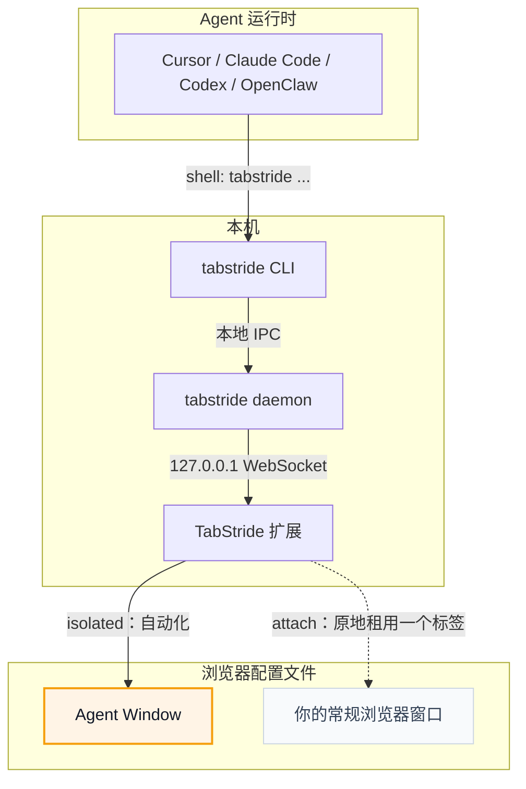

# TabStride

<p align="center">
  
</p>

<p align="center">
  <strong>让 AI Agent 操作你的浏览器，而不打断你的工作。</strong>
</p>

<p align="center">
  <a href="README.md">English</a> · 中文
</p>

**TabStride** 把 Cursor、Claude Code、Codex、OpenClaw、CodeBuddy、WorkBuddy、Pi、Hermes Agent 等支持 Shell 的 AI Agent 连接到你已登录的浏览器。

需要 Agent 原地操作当前标签页？使用 `tabstride session start --mode attach --tab active`；它不会新建窗口、移动标签或影响同窗口的其他标签。

## TabStride 的优势

- **复用真实登录态**：Agent 可以操作你已经登录的网站，不需要额外测试账号。
- **两种安全模式**：默认使用独立可见的 Agent Window；attach 模式只租用你明确指定的现有标签页。
- **支持任意 Agent**：只要 Agent 能调用 Shell，就可以通过 `tabstride` CLI 使用 TabStride，不绑定特定模型、Agent 框架或 harness。
- **内置 human-in-loop**：遇到 captcha、登录、确认弹窗等必须由人处理的步骤时，Agent 可以主动请求你接管，完成后再继续任务。

## 运行环境

TabStride 由两个本地运行组件组成：`tabstride` CLI/daemon 和浏览器扩展。

| 运行项 | 支持情况 |
| --- | --- |
| 操作系统 | macOS（Apple Silicon 和 Intel）、Linux（x64 和 ARM64）、Windows x64 |
| 浏览器 | 已支持 Chrome 和 Microsoft Edge；其他支持加载 Chromium 扩展的浏览器通常可用；Firefox 计划中 |

## 快速开始

<details open>
<summary><b>让 Agent 帮你安装（推荐）</b></summary>

<br>

已经在用 Cursor、Claude Code、Codex 或其他支持 Shell 的 Agent？只需复制下面这句话发给 Agent，它会帮你安装 CLI 和 skill，并引导你加载浏览器扩展：

```text
按照 https://raw.githubusercontent.com/Tencent/TabStride/main/AGENT_INSTALL.md 的说明，在本机安装并配置 tabstride
```

</details>

<details>
<summary><b>手动安装</b></summary>

<br>

先安装 CLI，再从 [Chrome Web Store](https://chromewebstore.google.com/detail/hhcmgoofomhgciiibhipgmgkgnoenaoi) 安装浏览器扩展。

#### 1. 安装 `tabstride` CLI

**macOS / Linux**（推荐，安装到 `~/.local/bin`）：

```bash
curl -fsSL https://raw.githubusercontent.com/Tencent/TabStride/main/install.sh | sh
```

**Windows**：从 [最新 CLI release](https://github.com/Tencent/TabStride/releases/latest)
下载 `tabstride-v<version>-x86_64-pc-windows-msvc.zip`，解压后将 `tabstride.exe` 加入 `PATH`。

验证二进制：

```bash
tabstride --version
```

#### 2. 安装浏览器扩展

从 [Chrome Web Store](https://chromewebstore.google.com/detail/hhcmgoofomhgciiibhipgmgkgnoenaoi) 安装 TabStride。

#### 3. 安装 skill

TabStride 自带 skill，用于教 Agent harness 如何使用 `tabstride`。以下 harness 可一键安装：

<p align="center">
<table>
  <tr>
    <td align="center" width="108"><a href="https://cursor.com" title="Cursor"></a><br /><sub><b>Cursor</b></sub></td>
    <td align="center" width="108"><a href="https://docs.anthropic.com/en/docs/claude-code" title="Claude Code"></a><br /><sub><b>Claude Code</b></sub></td>
    <td align="center" width="108"><a href="https://developers.openai.com/codex" title="Codex"></a><br /><sub><b>Codex</b></sub></td>
    <td align="center" width="108"><a href="https://openclaw.ai" title="OpenClaw"></a><br /><sub><b>OpenClaw</b></sub></td>
    <td align="center" width="108"><a href="https://www.codebuddy.ai" title="CodeBuddy"></a><br /><sub><b>CodeBuddy</b></sub></td>
    <td align="center" width="108"><a href="https://www.workbuddy.ai" title="WorkBuddy"></a><br /><sub><b>WorkBuddy</b></sub></td>
    <td align="center" width="108"><a href="https://github.com/badlogic/pi-mono" title="Pi"></a><br /><sub><b>Pi</b></sub></td>
    <td align="center" width="108"><a href="https://github.com/NousResearch/hermes-agent" title="Hermes Agent"></a><br /><sub><b>Hermes Agent</b></sub></td>
  </tr>
</table>
</p>

```bash
tabstride install-skill
```

用 <kbd>Space</kbd> 选择需要安装的 Agent harness，然后按 <kbd>Enter</kbd> 安装 skill。运行 `tabstride install-skill --list` 可查看 internal 变体及安装路径。

其他支持 Shell 的 Agent harness 也可使用 TabStride，但需手动将 [`skill/SKILL.md`](skill/SKILL.md) 复制到对应 skills 目录下的 `tabstride/SKILL.md`。

</details>

启动一个新的 Agent 会话，写一条需要使用浏览器的 prompt，例如：

```text
/tabstride open example.com and summarize what is on the page.
```

### 在前台运行本地服务

运行浏览器命令前，先显式启动 TabStride 服务：

```bash
tabstride serve
```

这是唯一正式的服务启动入口。IPC、WebSocket、Session 管理和请求处理会一起启动，并在按下
<kbd>Ctrl</kbd>+<kbd>C</kbd> 后一起停止。WebSocket 端口和 Session 空闲时间可通过
`tabstride serve --help` 配置。

业务命令在另一个终端中运行。服务未启动时，命令会立即失败并提示运行 `tabstride serve`，不会在后台
悄悄创建 daemon。`tabstride status` 和 `tabstride doctor` 保留为只读诊断命令，也不会启动服务。

### 选择 Session 模式

TabStride 支持两种 Session 模式：

- **Isolated（默认）**：`tabstride session start` 会打开一个独立的 Agent Window，适合让 Agent
  在不影响当前浏览内容的环境中工作。
- **Attach**：`tabstride session start --mode attach --tab active` 会原地租用当前 Chrome 窗口的
  活动标签页。已知标签页 ID 时，也可以使用 `--tab-id <ID>`。

例如，在一个终端中保持 `tabstride serve` 运行，在另一个终端中执行完整生命周期：

```bash
session_id=$(tabstride session start --mode attach --tab active)
tabstride snapshot --session "$session_id"
# navigate、click、fill 等业务命令始终使用同一个 session id
tabstride session stop "$session_id"
```

Attach 模式只控制一个明确指定的现有标签页：不会创建新窗口、移动标签页、访问同窗口的其他标签页，
也不允许 `tab create`、`tab close`、`tab borrow`、`tab return` 等标签管理命令。停止 Session 时会
解除浏览器控制并隐藏“Agent 正在控制”提示，但保留用户原有的标签页和窗口。即使执行过程中出错，也必须
停止 Session。

### 可靠定位页面元素

`click`、`fill`、`press`、`select` 共用同一套严格 Locator。目标可以使用 Snapshot `ref`、`css`、
`role` + 无障碍 `name`、`label`、`placeholder`、可见 `text` 或 `testId`；语义定位可能匹配过宽时
可增加 `--exact`：

```bash
tabstride click --role button --name 保存 --exact --session "$session_id"
tabstride fill --label 邮箱 --value agent@example.com --session "$session_id"
tabstride press Enter --placeholder "添加任务" --session "$session_id"
tabstride select --test-id country --value SG --session "$session_id"
```

原有 ref/CSS 位置参数仍然可用，例如 `tabstride click @e3` 或 `tabstride click '#submit'`。
所有 Locator 都执行严格匹配：0 个元素返回 `not_found`，1 个元素继续执行，多个元素返回
`ambiguous_target`，不会静默选择第一个。

### 持久 Agent Client

能够长期保持子进程的 Agent harness 应使用 `tabstride client`。它只与 `tabstride serve` 完成一次
经过认证的 WebSocket 握手，随后从 stdin 接收一行一个的协议请求，并将带有对应 ID 的响应写入 stdout：

```text
{"id":"start-1","method":"session.start","params":{"mode":"attach","tab":"active"}}
{"id":"snap-1","method":"tool.snapshot","params":{"session_id":"abcd"}}
{"id":"stop-1","method":"session.stop","params":{"session_id":"abcd"}}
```

请求可以流水线提交，也可以通过请求 ID 取消。连接支持心跳、拒绝重复的进行中 ID，并在 Client 断开时
清理未完成请求及由该连接创建的 Session。`/agent` 只监听 localhost，并要求使用保存在用户专属 daemon
信息文件中的随机凭证；`tabstride client` 会自动完成认证。

### 使用 Flow 批量执行确定步骤

当完整操作顺序已经明确时，使用 Flow。CLI 先在本地校验 YAML，再通过一次 `flow.run` 请求把所有步骤
提交给服务：

```bash
tabstride flow validate examples/flows/todomvc.yaml
tabstride flow run examples/flows/todomvc.yaml --session "$session_id" --var task="写代码"
```

Flow v1 支持 `navigate`、`click`、`fill`、`press`、`snapshot` 和 daemon 本地的 `wait_ms`。
所有步骤按顺序复用单条命令使用的同一个 Session 队列；第一步失败后立即停止，并返回失败步骤及已完成
步骤的耗时。Flow 总 `timeout` 与各工具的 `timeout_ms` 独立生效，Ctrl+C 会取消当前步骤和剩余 Flow。
Flow 与单条 CLI 命令使用相同的 Locator 对象和执行路径。例如
`target: { role: button, name: 保存, exact: true }` 的匹配规则、错误、作用域和超时行为完全一致。

业务请求会记录日志，但不会记录请求内容：

```text
INFO request started   rpc_id=nav-a1b2 method="tool.navigate" session="abcd" browser="5301f701"
INFO request timing    rpc_id=nav-a1b2 method="tool.navigate" queue_wait_us=81 websocket_us=740 extension_dispatch_us=118420 cdp_us=93470 daemon_runtime_us=119310
INFO request completed rpc_id=nav-a1b2 method="tool.navigate" session="abcd" browser="5301f701" duration_ms=119 total_runtime_us=119508 outcome="ok"
```

INFO 级别不记录健康检查请求；表单值、页面内容、选择器和执行脚本均不会进入请求日志。
使用 `tabstride -v <业务命令>` 还会在 CLI 侧输出 `cli_startup_us`、
`daemon_check_us`、`ipc_connect_us` 和 `total_runtime_us`。所有 Timing 使用微秒，
因此本地 IPC 等不足 1ms 的阶段也能被准确观察。

## 工作原理

TabStride 是 Agent 运行时与浏览器之间的本地桥接层。



Agent 不直接与浏览器通信。它通过 `tabstride` CLI 下发浏览器任务；本地 daemon 把请求路由到扩展；扩展默认在 Agent Window 中执行，也可以通过 attach 模式原地控制一个明确授权的现有标签。

## 面向开发者

本仓库是 Cargo + pnpm workspace：

- `crates/tabstride-cli` — `tabstride` CLI 与本地 daemon
- `crates/tabstride-protocol` — 共享协议类型与 JSON Schema
- `apps/extension` — 浏览器扩展
- `packages/ui` 和 `packages/i18n` — 扩展 UI 共享支持

## 许可证

MIT
