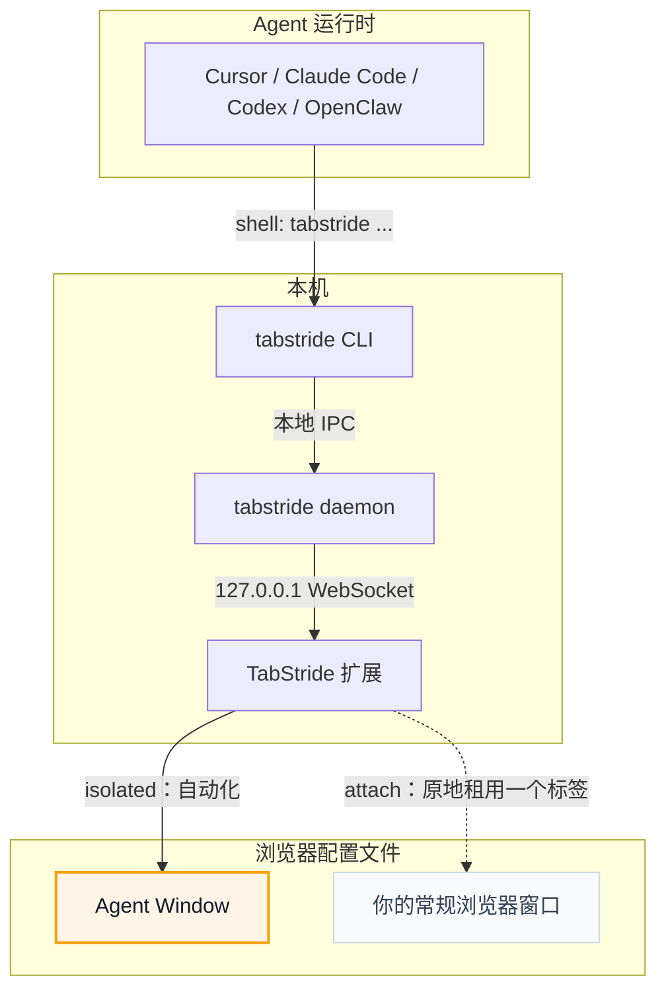

# TabStride

<p align="center">
  
</p>

<p align="center">
  <strong>让 AI Agent 操作你的浏览器，而不打断你的工作。</strong>
</p>

<p align="center">
  <a href="README.md">English</a> · 中文
</p>

**TabStride** 把 Cursor、Claude Code、Codex、OpenClaw、CodeBuddy、WorkBuddy、Pi、Hermes Agent 等支持 Shell 的 AI Agent 连接到你已登录的浏览器。

需要 Agent 原地操作当前标签页？使用 `tabstride session start --mode attach --tab active`；它不会新建窗口、移动标签或影响同窗口的其他标签。

## TabStride 的优势

- **复用真实登录态**：Agent 可以操作你已经登录的网站，不需要额外测试账号。
- **两种安全模式**：默认使用独立可见的 Agent Window；attach 模式只租用你明确指定的现有标签页。
- **支持任意 Agent**：只要 Agent 能调用 Shell，就可以通过 `tabstride` CLI 使用 TabStride，不绑定特定模型、Agent 框架或 harness。
- **内置 human-in-loop**：遇到 captcha、登录、确认弹窗等必须由人处理的步骤时，Agent 可以主动请求你接管，完成后再继续任务。

## 运行环境

TabStride 由两个本地运行组件组成：`tabstride` CLI/daemon 和浏览器扩展。

| 运行项 | 支持情况 |
| --- | --- |
| 操作系统 | macOS（Apple Silicon 和 Intel）、Linux（x64 和 ARM64）、Windows x64 |
| 浏览器 | 已支持 Chrome 和 Microsoft Edge；其他支持加载 Chromium 扩展的浏览器通常可用；Firefox 计划中 |

## 快速开始

<details open>
<summary><b>让 Agent 帮你安装（推荐）</b></summary>

<br>

已经在用 Cursor、Claude Code、Codex 或其他支持 Shell 的 Agent？只需复制下面这句话发给 Agent，它会帮你安装 CLI 和 skill，并引导你加载浏览器扩展：

```text
按照 https://raw.githubusercontent.com/Tencent/TabStride/main/AGENT_INSTALL.md 的说明，在本机安装并配置 tabstride
```

</details>

<details>
<summary><b>手动安装</b></summary>

<br>

先安装 CLI，再从 [Chrome Web Store](https://chromewebstore.google.com/detail/hhcmgoofomhgciiibhipgmgkgnoenaoi) 安装浏览器扩展。

#### 1. 安装 `tabstride` CLI

**macOS / Linux**（推荐，安装到 `~/.local/bin`）：

```bash
curl -fsSL https://raw.githubusercontent.com/Tencent/TabStride/main/install.sh | sh
```

**Windows**：从 [最新 CLI release](https://github.com/Tencent/TabStride/releases/latest)
下载 `tabstride-v<version>-x86_64-pc-windows-msvc.zip`，解压后将 `tabstride.exe` 加入 `PATH`。

验证二进制：

```bash
tabstride --version
```

#### 2. 安装浏览器扩展

从 [Chrome Web Store](https://chromewebstore.google.com/detail/hhcmgoofomhgciiibhipgmgkgnoenaoi) 安装 TabStride。

#### 3. 安装 skill

TabStride 自带 skill，用于教 Agent harness 如何使用 `tabstride`。以下 harness 可一键安装：

<p align="center">
<table>
  <tr>
    <td align="center" width="108"><a href="https://cursor.com" title="Cursor"></a><br /><sub><b>Cursor</b></sub></td>
    <td align="center" width="108"><a href="https://docs.anthropic.com/en/docs/claude-code" title="Claude Code"></a><br /><sub><b>Claude Code</b></sub></td>
    <td align="center" width="108"><a href="https://developers.openai.com/codex" title="Codex"></a><br /><sub><b>Codex</b></sub></td>
    <td align="center" width="108"><a href="https://openclaw.ai" title="OpenClaw"></a><br /><sub><b>OpenClaw</b></sub></td>
    <td align="center" width="108"><a href="https://www.codebuddy.ai" title="CodeBuddy"></a><br /><sub><b>CodeBuddy</b></sub></td>
    <td align="center" width="108"><a href="https://www.workbuddy.ai" title="WorkBuddy"></a><br /><sub><b>WorkBuddy</b></sub></td>
    <td align="center" width="108"><a href="https://github.com/badlogic/pi-mono" title="Pi"></a><br /><sub><b>Pi</b></sub></td>
    <td align="center" width="108"><a href="https://github.com/NousResearch/hermes-agent" title="Hermes Agent"></a><br /><sub><b>Hermes Agent</b></sub></td>
  </tr>
</table>
</p>

```bash
tabstride install-skill
```

用 <kbd>Space</kbd> 选择需要安装的 Agent harness，然后按 <kbd>Enter</kbd> 安装 skill。运行 `tabstride install-skill --list` 可查看 internal 变体及安装路径。

其他支持 Shell 的 Agent harness 也可使用 TabStride，但需手动将 [`skill/SKILL.md`](skill/SKILL.md) 复制到对应 skills 目录下的 `tabstride/SKILL.md`。

</details>

启动一个新的 Agent 会话，写一条需要使用浏览器的 prompt，例如：

```text
/tabstride open example.com and summarize what is on the page.
```

### 在前台运行本地服务

运行浏览器命令前，先显式启动 TabStride 服务：

```bash
tabstride serve
```

这是唯一正式的服务启动入口。IPC、WebSocket、Session 管理和请求处理会一起启动，并在按下
<kbd>Ctrl</kbd>+<kbd>C</kbd> 后一起停止。WebSocket 端口和 Session 空闲时间可通过
`tabstride serve --help` 配置。

业务命令在另一个终端中运行。服务未启动时，命令会立即失败并提示运行 `tabstride serve`，不会在后台
悄悄创建 daemon。`tabstride status` 和 `tabstride doctor` 保留为只读诊断命令，也不会启动服务。

### 选择 Session 模式

TabStride 支持两种 Session 模式：

- **Isolated（默认）**：`tabstride session start` 会打开一个独立的 Agent Window，适合让 Agent
  在不影响当前浏览内容的环境中工作。
- **Attach**：`tabstride session start --mode attach --tab active` 会原地租用当前 Chrome 窗口的
  活动标签页。已知标签页 ID 时，也可以使用 `--tab-id <ID>`。

例如，在一个终端中保持 `tabstride serve` 运行，在另一个终端中执行完整生命周期：

```bash
session_id=$(tabstride session start --mode attach --tab active)
tabstride snapshot --session "$session_id"
# navigate、click、fill 等业务命令始终使用同一个 session id
tabstride session stop "$session_id"
```

Attach 模式只控制一个明确指定的现有标签页：不会创建新窗口、移动标签页、访问同窗口的其他标签页，
也不允许 `tab create`、`tab close`、`tab borrow`、`tab return` 等标签管理命令。停止 Session 时会
解除浏览器控制并隐藏“Agent 正在控制”提示，但保留用户原有的标签页和窗口。即使执行过程中出错，也必须
停止 Session。
如果用户点击 Chrome 顶部“TabStride started debugging this browser”提示中的 **取消**，TabStride
会将其视为用户明确撤销控制：当前命令以 `user_aborted` 结束、attach Session 被释放，Agent 必须立即
停止。只有收到用户新的操作请求后才能重新创建 attach Session，禁止自动重试或重新接管。

Chrome 插件弹窗始终提供可展开/折叠的“AI 操作日志”面板，并保留最近 100 条跨 Session 操作。
Session 运行期间，页面底部控制条也提供相同的实时日志视图。日志显示执行中/成功/失败状态、安全的目标摘要
和耗时，不会记录填写内容、执行脚本、页面正文或 URL 查询参数。

### 可靠定位页面元素

`click`、`fill`、`press`、`select` 共用同一套严格 Locator。目标可以使用 Snapshot `ref`、`css`、
`role` + 无障碍 `name`、`label`、`placeholder`、可见 `text` 或 `testId`；语义定位可能匹配过宽时
可增加 `--exact`：

```bash
tabstride click --role button --name 保存 --exact --session "$session_id"
tabstride fill --label 邮箱 --value agent@example.com --session "$session_id"
tabstride press Enter --placeholder "添加任务" --session "$session_id"
tabstride select --test-id country --value SG --session "$session_id"
```

原有 ref/CSS 位置参数仍然可用，例如 `tabstride click @e3` 或 `tabstride click '#submit'`。
所有 Locator 都执行严格匹配：1 个元素继续执行，多个元素立即返回 `ambiguous_target`，不会静默
选择第一个。0 个元素会进入 Auto Wait；截止时间内仍未出现时返回 `timeout`，并携带
`reason=locator_not_found`（Snapshot ref 则为 `ref_not_found`）。

扩展在真正执行交互前，会为 CLI 和 Flow 运行同一套 Actionability Engine。click 会等待目标处于
已连接、可见、稳定、启用、可接收事件且未被遮挡的状态；fill 还要求目标可编辑；select 要求目标是
已启用的原生 `<select>`；指定目标的 press 要求元素可见且可聚焦。命令会遵守 `--timeout`、支持取消，
并在 DOM 变化、页面生命周期事件或短周期几何检查后，用原始严格 Locator 重新解析目标。使用
`--json` 时，超时错误包含 `reason`、`failed_check`、`elapsed_ms` 和 `last_state`
等机器可读字段。

每个 `click`、`fill`、`press`、`select` 都支持 `--page-update none|signal|delta`：

```bash
tabstride click --role button --name 保存 --session "$session_id" --page-update delta
```

- `signal`（默认）返回 `document_changed`、`document_change_known` 和 `document_version`，
  但不获取 AX Tree；
- `none` 跳过动作后的页面观察，固定步骤可用它获得最低开销；
- `delta` 在存在精确匹配的 Snapshot 缓存基线时返回 `snapshot_delta`。状态包括
  `available`、`unchanged`、`full_required` 和 `delta_unavailable`。`available` 会携带新增
  Snapshot 文本与 `removed_refs`；后两种状态需要回退到普通 Snapshot。

JSON 输出会保留完整结构化字段；human 输出会显示变化状态和 Delta 状态，并在可用时继续打印增量
Snapshot 文本。旧扩展不支持 Delta 时会明确显示 `delta_unavailable`，不会伪装成空变化。

### 使用 Auto Wait 断言页面状态

`tabstride assert` 会持续重试页面状态，直到断言成立或达到 `--timeout`。元素断言支持
visible/hidden、文本 equals/contains、value equals、enabled/disabled、checked/unchecked 和匹配数量；
URL 断言支持完全相等和 JavaScript 正则表达式：

```bash
tabstride assert --text "写代码" --exact --visible --session "$session_id"
tabstride assert --css '.todo.completed' --count 3 --session "$session_id"
tabstride assert --url-matches '/todomvc/#/completed$' --session "$session_id"
```

每轮重试都会使用原始 Locator 重新解析元素。除 `count` 外，元素断言保持严格匹配；`hidden` 在
0 匹配时也成立。超时错误包含 `reason=assertion_failed`、`expected`、`actual`、`elapsed_ms`
和 `match_count`。

### 查看最小失败 Evidence

交互或断言失败时，JSON 错误会附带尽力采集的 `data.evidence`：原始 Locator、匹配数量、
Actionability 每轮状态、最后失败检查、当前 URL、失败时的无障碍 Snapshot 和 PNG Screenshot、
最近 Console Error，以及 Locator/等待/CDP/Evidence 分段耗时。采集失败不会覆盖原始错误，
缺失内容会记录在 `collection_errors`。

```bash
tabstride --json assert --css '#save' --visible --session "$session_id"
```

`--timeout` 仍然只表示浏览器业务等待时间。失败后服务最多额外保留两秒，让扩展完成 Evidence
采集；取消操作仍会立即结束，并主动跳过采集。

### 持久 Agent Client

开始浏览器操作前先选择执行路径：

- 确定性任务：attach（按需合并初始 Snapshot）→ 一个 `flow.run` → stop；
- 自适应任务：保持一个 `tabstride client` 进程，用它完成 attach、决策点请求、Snapshot/Delta 更新和 stop。

正常任务禁止把 status/doctor/browsers 当作就绪预检。一个 Flow 是一次 Agent 到 daemon 的请求，
但 daemon 仍会为每个浏览器 Step 分别发送扩展 WebSocket 请求。

执行自适应任务且能够保持子进程的 Agent harness 应使用 `tabstride client`。它只与 `tabstride serve` 完成一次
经过认证的 WebSocket 握手，随后从 stdin 接收一行一个的协议请求，并将带有对应 ID 的响应写入 stdout：

```text
{"id":"start-1","method":"session.start","params":{"mode":"attach","tab":"active","snapshot":true}}
{"id":"snap-1","method":"tool.snapshot","params":{"session_id":"abcd"}}
{"id":"stop-1","method":"session.stop","params":{"session_id":"abcd"}}
```

请求可以流水线提交，也可以通过请求 ID 取消。连接支持心跳、拒绝重复的进行中 ID，并在 Client 断开时
清理未完成请求及由该连接创建的 Session。`/agent` 只监听 localhost，并要求使用保存在用户专属 daemon
信息文件中的随机凭证；`tabstride client` 会自动完成认证。

Snapshot Delta 为 `available` 时直接消费；只有 `full_required`、`delta_unavailable`、旧扩展未返回 Delta，
或 `document_change_known=false` 时才执行 `tool.snapshot`。收到 `user_aborted` 后必须立即结束任务，
禁止重试或创建替代 attach Session，直到用户发起新的请求。

### 使用 Flow 批量执行确定步骤

当完整操作顺序已经明确时，使用 Flow。CLI 先在本地校验 YAML，再通过一次 `flow.run` 请求把所有步骤
提交给服务：

```bash
tabstride flow validate examples/flows/todomvc.yaml
tabstride flow run examples/flows/todomvc.yaml --session "$session_id" --var task="写代码"
```

Flow v1 支持 `navigate`、`click`、`fill`、`press`、`select`、`wait_for`、
`request_help`、`assert`、`snapshot` 和 daemon 本地的 `wait_ms`。
所有步骤按顺序复用单条命令使用的同一个 Session 队列；第一步失败后立即停止，并返回已完成步骤耗时，
以及失败、超时或中断步骤的结构化 `failed_step_result`。每个已开始的浏览器步骤都包含 `timing`；
`wait_ms` 等 daemon 本地步骤只返回 `local_us`，不会伪造 WebSocket/CDP 阶段；如果用户取消早于扩展 Timing 返回，`local_us` 保留 daemon 实际观察到的步骤耗时。使用 `--json` 查看完整失败数据。
`websocket_us` 只包含请求与响应的双向传输，`websocket_roundtrip_us` 还包含扩展执行；
`extension_us` 是扩展总耗时，`extension_non_cdp_us` 会扣除逐次 CDP 调用之和；`cdp_us`
是各次 CDP 调用耗时累计，`cdp_span_us` 是第一次 CDP 开始到最后一次结束的诊断跨度，可能包含调用间等待。
Flow 总 `timeout` 与各工具的 `timeout_ms` 独立生效，Ctrl+C 会取消当前步骤和剩余 Flow。
Flow 与单条 CLI 命令使用相同的 Locator 对象和执行路径。例如
`target: { role: button, name: 保存, exact: true }` 的匹配规则、错误、作用域和超时行为完全一致。

Flow 的交互步骤也支持同一个 `page_update` 字段：

```yaml
- click:
    target: { role: button, name: 保存, exact: true }
    page_update: delta
```

使用稳定语义 Locator 的确定性中间步骤可选 `none`；只需要判断页面是否变化时保留默认 `signal`；
只有已经建立 Snapshot 基线、且下一步决策需要新页面结构时才请求 `delta`。

页面就绪应优先使用 `wait_for`，而不是固定延时。它会反复按原始 Locator 重新解析，直到目标达到
`attached`、`detached`、`visible`、`hidden`、`enabled`、`disabled`、`editable`、
`checked`、`unchecked` 或 `populated`。`request_help` 可在验证码、登录或确认场景暂停同一个 Flow：
用户选择继续才执行下一步；取消、超时或页面跳转都会终止 Flow。Flow 总超时应大于人工步骤超时。

步骤内的 `assert` 用于决定能否继续下一步；顶层 `assertions` 是最终验收条件，只在所有动作成功后执行。
两者都与 `tabstride assert` 共用 Web-first 扩展执行器：

```yaml
steps:
  - wait_for:
      target: { label: 账户名称 }
      state: populated
  - request_help:
      prompt: 请完成页面确认，然后点击继续。
      timeout_ms: 60000
assertions:
  - target: { text: 已保存, exact: true }
    visible: true
    timeout_ms: 5000
```

完整组合示例见 [`examples/flows/complete-runtime.yaml`](examples/flows/complete-runtime.yaml)。

业务请求会记录日志，但不会记录请求内容：

```text
INFO request started   rpc_id=nav-a1b2 method="tool.navigate" session="abcd" browser="5301f701"
INFO request completed rpc_id=nav-a1b2 method="tool.navigate" session="abcd" browser="5301f701" duration_ms=119 outcome="ok"
```

INFO 级别不记录健康检查请求；表单值、页面内容、选择器和执行脚本均不会进入请求日志。
使用 `tabstride <业务命令> --timing` 可输出 CLI 启动、IPC 连接、队列等待、
WebSocket、扩展 dispatch、CDP 和总 Runtime，单位均为微秒。历史数据可通过
`tabstride metrics summary` 汇总，或用 `tabstride metrics export --out metrics.json` 导出。
Flow 指标可按名称和步骤过滤，例如 `tabstride metrics summary --flow checkout --step-index 2`。
重复观察页面时，可使用 `snapshot --incremental` 复用 Document Version 缓存并只返回 AX 树变化。

## 工作原理

TabStride 是 Agent 运行时与浏览器之间的本地桥接层。


```mermaid
flowchart TB
  subgraph Harness["Agent 运行时"]
    Agent["Cursor / Claude Code / Codex / OpenClaw"]
  end

  subgraph Local["本机"]
    CLI["tabstride CLI"]
    Daemon["tabstride daemon"]
    Extension["TabStride 扩展"]
  end

  subgraph Browser["浏览器配置文件"]
    AgentWindow["Agent Window"]
    UserWindows["你的常规浏览器窗口"]
  end

  Agent -->|"shell: tabstride ..."| CLI
  CLI -->|"本地 IPC"| Daemon
  Daemon -->|"127.0.0.1 WebSocket"| Extension
  Extension -->|"isolated：自动化"| AgentWindow
  Extension -.->|"attach：原地租用一个标签"| UserWindows

  style AgentWindow fill:#fff4e6,stroke:#f59e0b,stroke-width:2px,color:#111827
  style UserWindows fill:#f8fafc,stroke:#cbd5e1,color:#334155
```

Agent 不直接与浏览器通信。它通过 `tabstride` CLI 下发浏览器任务；本地 daemon 把请求路由到扩展；扩展默认在 Agent Window 中执行，也可以通过 attach 模式原地控制一个明确授权的现有标签。

## 面向开发者

本仓库是 Cargo + pnpm workspace：

- `crates/tabstride-cli` — `tabstride` CLI 与本地 daemon
- `crates/tabstride-protocol` — 共享协议类型与 JSON Schema
- `apps/extension` — 浏览器扩展
- `packages/ui` 和 `packages/i18n` — 扩展 UI 共享支持

版本能力、兼容边界以及升级/回滚步骤见 [0.2.0 发布说明](docs/release-notes-0.2.0.md)。

## 许可证

MIT
