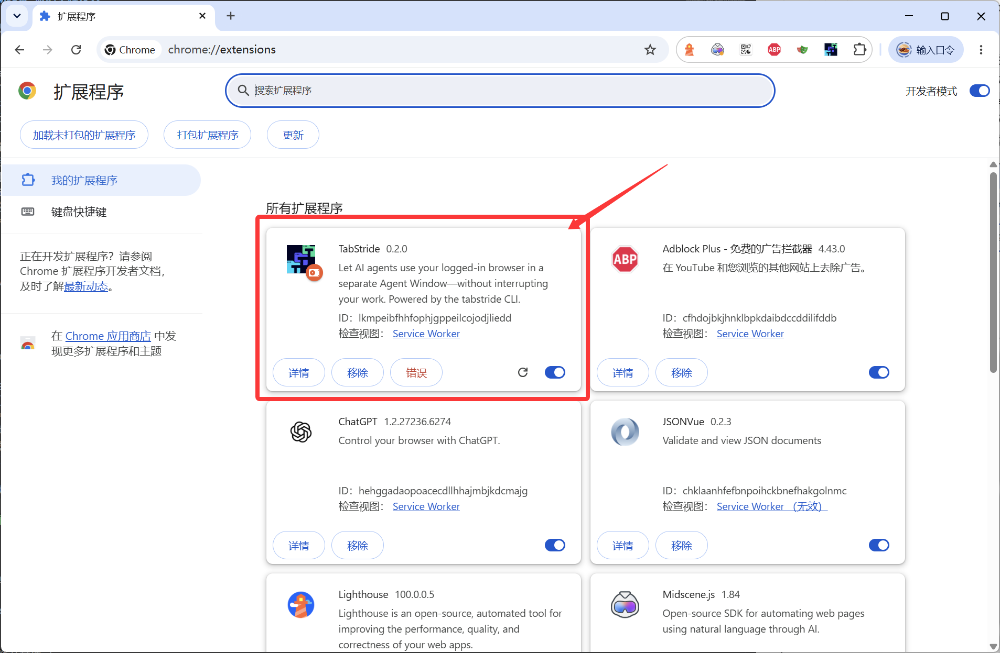
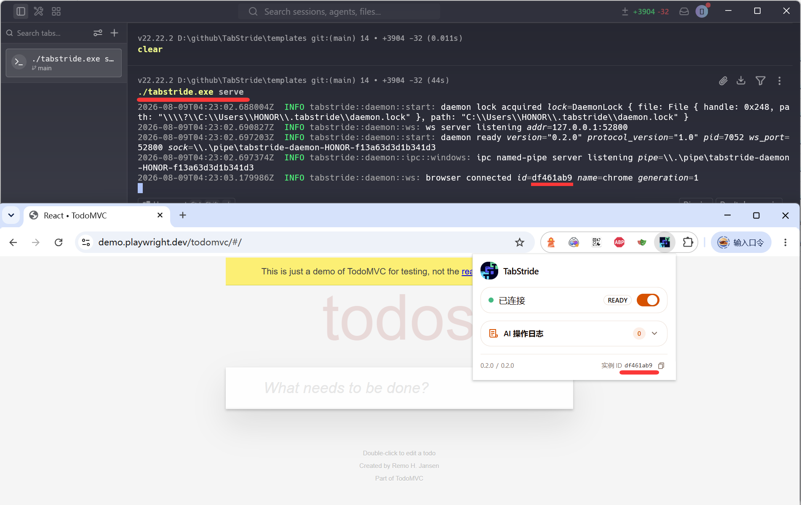
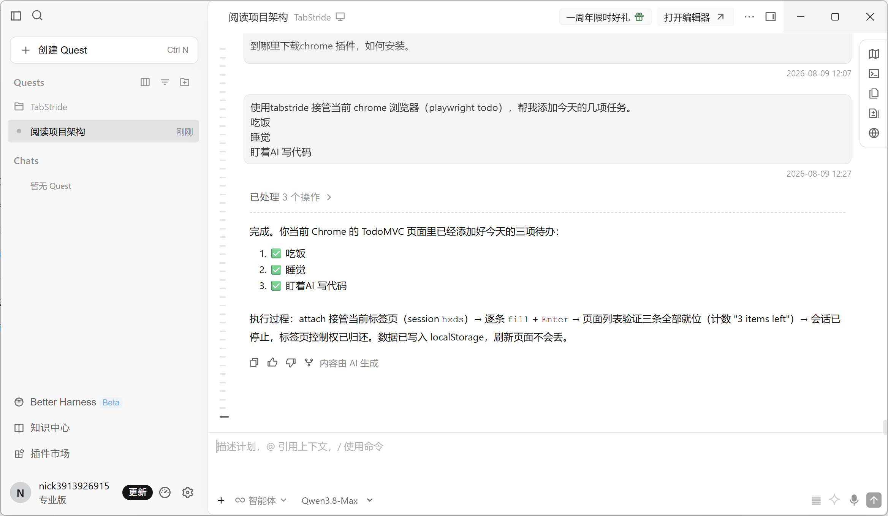
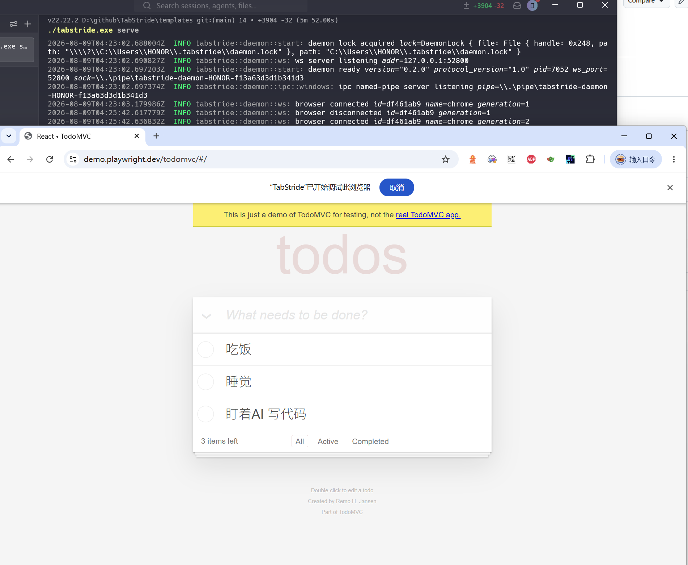
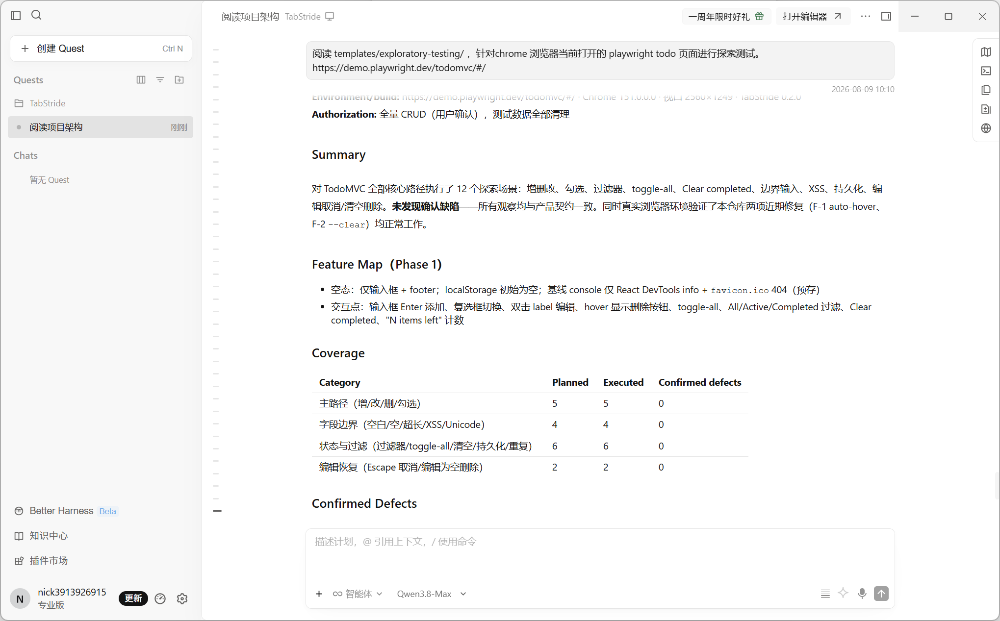

# TabStride：让 AI Agent 成为你的自动化测试助手

> **TabStride** —— 让 AI Agent 随时接管你的浏览器，用你已登录的账号完成页面验证与探索性测试。

---

## 回顾过往

我是一名工作十几年的测试工程师。从刚工作时接触 QTP，到开源自动化工具 Selenium 兴起，大概 2013～2023 年是 Selenium 最辉煌的十年，我先后写过两本介绍 Selenium 的书。之后是 Playwright 的兴起，它提供的 API 更好用，运行速度更快。

近几年 AI 技术迅速崛起，Playwright 也更加拥抱 AI——Playwright MCP、Playwright CLI 等相继出现。那么接下来，UI 自动化工具应该怎么走？这是我一直思考的问题。

## UI 自动化的价值

我们做自动化的目的是为了回归测试，只有可以持续回归的次数越多，产生的收益越大。真的是这样吗？

如果一个功能持续在变，必然需要投入资源和精力去维护自动化用例；如果一个功能永远不变，我回归很多次的意义又是什么？何况 UI 自动化天生脆弱——运行失败也不一定就是发现了 bug，还需要投入人工二次确认，以及调试用例本身。

从自我需求出发，我觉得真正高价值的有两个场景：

1. **随时接管我的浏览器，完成页面功能的验证。** 例如：一个表单，帮我验证必填字段、类型、长度，或者快速随机生成有意义的测试数据（邮箱、地址、手机号）。
2. **探索性测试。** 当一个需求（包含若干页面的功能）接近尾声，我希望有逻辑地（而非 monkey 测试）探索整个页面的功能，查漏补缺。

这两个场景有一个共同前提：**Agent 必须能用上我自己已经登录的浏览器。** 测试账号难申请、登录态难复刻、验证码过不去——传统"新开一个浏览器实例"的自动化方案在这里全部失效。

这就是我打造 TabStride 的原因。

---

## TabStride 是什么？

TabStride 是一个本地桥接层，把支持 Shell 的 AI Agent（Cursor、Claude Code、Codex、OpenClaw、CodeBuddy、WorkBuddy、Pi、Hermes Agent 等）连接到你**已登录**的浏览器。它由两部分组成：

- **`tabstride` CLI**：Rust 编写的命令行工具 + 本地 daemon，Agent 通过 Shell 即可调用；
- **浏览器扩展**：安装在你的 Chrome / Edge 中，负责真正执行页面操作。


```
Agent (Cursor / Claude Code / Codex / ...)
   │  shell: tabstride click / fill / snapshot ...
   ▼
tabstride CLI ──本地 IPC──▶ daemon ──127.0.0.1 WebSocket──▶ 浏览器扩展 ──▶ 你的浏览器
```

全程本地通信，无云端中转。它不新开浏览器，直接驱动你手边这一个。

## 核心能力

### 1. 复用真实登录态

Agent 直接操作你已经登录的网站。不需要测试账号，不需要导出 Cookie，不需要处理 SSO 跳转——因为这就是你自己的浏览器。内网系统、扫码登录的后台、带 MFA 的企业应用，Agent 都能直接上手。

这正是"随时接管浏览器验证表单"场景的基础：真实环境、真实数据、真实校验。

### 2. 两种安全模式，各取所需

- **Isolated 模式（默认）**：开一个独立可见的 Agent Window。Agent 在旁边的窗口干活，你继续你自己的浏览，互不打扰。
- **Attach 模式**：原地接管你指定的某一个标签页——不新建窗口、不移动标签、不碰同窗口的其他页面。`tabstride session start --mode attach --tab active` 一句话，当前页面就交给 Agent 了。

Attach 模式的安全边界很克制：只租用一个你明确指定的标签。你随时可以点击 Chrome 顶部横幅的"取消"收回控制权，Agent 会立即停止，绝不自动重试。

### 3. 内置 Human-in-Loop

自动化最怕验证码、短信确认、二次授权。TabStride 的解法是**让 Agent 主动喊你**：任务卡在"只有人能做"的步骤时，Agent 发起 `request_help`，你花 10 秒完成确认，Agent 接着往下跑。人机边界被设计在流程之内，而不是流程之外。

### 4. 不绑定任何 Agent

只要 Agent 能执行 Shell 命令，就能用 TabStride。一条 `tabstride install-skill`，自动把使用手册（Skill）装进你的 Agent 环境，它立刻知道怎么定位元素、怎么管理会话、怎么处理失败。不锁定模型，不锁定框架。

## 为"可靠地动起来"做的工程投入

TabStride 不只是"能点能填"的遥控器。做探索性测试的人都知道，工具最大的挫败感来自"点不动""找不准""不知道为什么失败"，这三件事都被认真对待：

- **严格 Locator**：`click` / `fill` / `press` / `select` 支持 ref、CSS、role+name、label、placeholder、可见文本、testId 七种定位；匹配到多个元素时立即报 `ambiguous_target`，绝不静默点错地方。
- **Actionability Engine**：交互前自动等待元素"可见、稳定、启用、未被遮挡、能接收事件"，连 hover 才出现的删除按钮也能自动处理——UI 自动化最经典的"元素明明在却点不到"，在这里大幅减少。
- **Auto Wait 断言**：`tabstride assert` 自动重试直到条件成立或超时，支持文本、可见性、数量、URL 正则。
- **失败证据链**：任何失败都附带结构化 evidence——快照、截图、Console 错误、逐轮等待状态。Agent 可以自己分析失败原因并自愈，不再需要你人工二次确认"到底是不是 bug"。
- **Flow 批量执行**：步骤确定的任务写成 YAML，一次提交、顺序执行、断言验收，带全链路耗时追踪。
- **探索性测试方法论**：项目还提供独立的探索测试模板（五阶段：侦察→提问→计划→执行→报告），配合 Coverage Ledger 和缺陷分级，让 AI 的探索不是一次性的"随便点点"，而是可审计的测试活动。
- **隐私设计**：操作日志只记录目标摘要和耗时，不记录填写内容、页面正文和 URL 参数；daemon 只监听 localhost。

## 快速上手

下面以 Windows 为例完整走一遍（macOS / Linux 同理，下载对应平台的包即可）：安装 → 启动 → 验证连通 → 两个真实案例。文中所有命令都是实际跑通的。

### 第 1 步：下载并安装浏览器扩展

扩展暂未上架 Chrome 商店，从 GitHub Releases 手动加载：

1. 打开 [TabStride Releases](https://github.com/SeldomQA/TabStride/releases)，找到 **TabStride Extension** 发布项（如 `ext-v0.2.0`），在 Assets 中下载 `tabstride-extension-v0.2.0-chrome.zip`（zip 包与操作系统无关，全平台通用）。
2. 将压缩包**解压到一个固定目录**（例如 `D:\tabstride-extension`）。注意：这个目录不能删，Chrome 每次启动都会从这里加载扩展。
3. Chrome 地址栏输入 `chrome://extensions/`，开启右上角的**开发者模式**。
4. 点击**加载已解压的扩展程序**，选择刚才解压的目录。
5. 扩展列表出现 **TabStride** 卡片即安装成功。



> 提示：以解压方式加载的扩展不会自动更新。以后每次发新版，下载新 zip 覆盖同一目录，再回到扩展卡片点刷新按钮即可。

### 第 2 步：下载并启动 CLI

CLI 是 Rust 单二进制，无依赖：

1. 在 [Releases](https://github.com/SeldomQA/TabStride/releases) 中找到 **TabStride CLI** 发布项（如 `cli-v0.2.0`），按平台下载：

   | 平台 | 资产文件 |
   | --- | --- |
   | Windows x64 | `tabstride-v0.2.0-x86_64-pc-windows-msvc.zip` |
   | macOS Apple Silicon | `tabstride-v0.2.0-aarch64-apple-darwin.tar.gz` |
   | macOS Intel | `tabstride-v0.2.0-x86_64-apple-darwin.tar.gz` |
   | Linux x64 | `tabstride-v0.2.0-x86_64-unknown-linux-musl.tar.gz` |
   | Linux ARM64 | `tabstride-v0.2.0-aarch64-unknown-linux-musl.tar.gz` |

2. 解压后将 `tabstride.exe`（或 `tabstride`）放入一个目录并加入系统 `PATH`，验证：

   ```powershell
   tabstride --version
   # 输出: 0.2.0
   ```

   不想手动下载的话，也可以一条脚本自动安装到 `~/.local/bin`：

   ```powershell
   # Windows PowerShell
   $env:TABSTRIDE_REPO = "SeldomQA/TabStride"; irm https://raw.githubusercontent.com/SeldomQA/TabStride/main/install.ps1 | iex
   ```

   ```bash
   # macOS / Linux
   curl -fsSL https://raw.githubusercontent.com/SeldomQA/TabStride/main/install.sh | TABSTRIDE_REPO=SeldomQA/TabStride sh
   ```

3. 在一个终端里启动本地服务（前台运行，Ctrl+C 停止）：

   ```powershell
   tabstride serve
   ```

4. 可选：把 Skill 装进你的 Agent 环境，让它知道怎么使用 tabstride：

   ```powershell
   tabstride install-skill
   ```

### 第 3 步：确认 CLI 与扩展正常通信

保持 `tabstride serve` 运行，**另开一个终端**执行：

```powershell
tabstride status
```

只要 `browsers` 列表非空，就说明扩展已通过 WebSocket 连上 daemon：

```json
{
  "daemon_version": "0.2.0",
  "browsers": [
    {
      "browser_name": "chrome",
      "browser_version": "151.0.0.0",
      "extension_version": "0.2.0",
      "version_skew": false
    }
  ]
}
```

三个关键点：`browsers` 有内容（扩展已连接）、`version_skew: false`（CLI 与扩展版本匹配）、扩展弹窗显示已连接。如果 `browsers` 为空，检查扩展是否已加载，或浏览器是否刚重启过（重启后需在 `chrome://extensions/` 重新启用扩展）。



### 案例一：接管当前页面，操作 TodoMVC

打开 Playwright 官方 TodoMVC 演示页 <https://demo.playwright.dev/todomvc/>。

打开你熟悉的 AI agent 工具，输入以下提示词：

```markdown
使用tabstride 接管当前 chrome 浏览器（playwright todo），帮我添加今天的几项任务。

* 吃饭
* 睡觉
* 盯着AI 写代码
```



稍后，你将会在浏览器中看到todo的操作。



这就是“随时接管浏览器验证页面功能”的能力。假如这是一个需要登录的系统，我们可以把只有人能完成的动作（例如手机验证码登录）交给人，把重复的、适合 AI 做的工作交给 AI——它就像给我们配了一个助手，所有脏活累活都可以丢给它完成。


### 案例二：对 TodoMVC 做一轮探索性测试

将项目中的 `templates/exploratory-testing/` 拷贝到你的项目目录中。

还是同一个页面，这次交给 Agent 一句话：

```text
阅读 templates/exploratory-testing/ ，针对chrome浏览器当前打开的 playwright todo 页面进行探索测试。
```



Agent 会按照内置的探索测试方法论执行五阶段：**侦察**（只读快照，不碰数据）→ **提问**（向我要 CRUD 授权）→ **计划**（列出场景清单）→ **执行** → **报告**。实际运行中，它覆盖了 12 个场景：

- 主路径：添加 3 条待办 → 计数验证 → 勾选完成 → 双击编辑 → 删除；
- 边界：空白输入被拒、500 字符超长文本、`<script>alert(1)</script>` XSS 内容被安全转义；
- 状态：All/Active/Completed 三个过滤器、toggle-all 全选、Clear completed；
- 恢复：刷新后数据持久化、Escape 取消编辑、编辑为空自动删除待办。


最终报告：

```md

# Exploratory Testing Report

**Target:** Playwright TodoMVC (React demo)
**Date:** 2026-08-01
**Session:** `thba` (attach 模式，已停止)
**Environment/build:** https://demo.playwright.dev/todomvc/#/ · Chrome 151.0.0.0 · 视口 2560×1249 · TabStride 0.2.0
**Authorization:** 全量 CRUD（用户确认），测试数据全部清理

## Summary

对 TodoMVC 全部核心路径执行了 12 个探索场景：增删改、勾选、过滤器、toggle-all、Clear completed、边界输入、XSS、持久化、编辑取消/清空删除。**未发现确认缺陷**——所有观察均与产品契约一致。同时真实浏览器环境验证了本仓库两项近期修复（F-1 auto-hover、F-2 `--clear`）均正常工作。

## Feature Map（Phase 1）

- 空态：仅输入框 + footer；localStorage 初始为空；基线 console 仅 React DevTools info + `favicon.ico` 404（预存）
- 交互点：输入框 Enter 添加、复选框切换、双击 label 编辑、hover 显示删除按钮、toggle-all、All/Active/Completed 过滤、Clear completed、"N items left" 计数

## Coverage

| Category | Planned | Executed | Confirmed defects |
|----------|---------|----------|-------------------|
| 主路径（增/改/删/勾选） | 5 | 5 | 0 |
| 字段边界（空白/空/超长/XSS/Unicode） | 4 | 4 | 0 |
| 状态与过滤（过滤器/toggle-all/清空/持久化/重复） | 6 | 6 | 0 |
| 编辑恢复（Escape 取消/编辑为空删除） | 2 | 2 | 0 |

## Confirmed Defects

无（0 个）。零缺陷报告有效：成熟 demo 应用，行为均有可信 Oracle（产品契约/标准 TodoMVC 规范）。

## Risks / Questions / Observations

- **O-1** `favicon.ico` 404 —— 预存基线错误，无功能影响
- **O-2** 重复同名 todo 允许创建（DUP-01 ×2）—— 无去重契约，属设计行为
- **O-3** 空白输入被拒绝后仍保留在输入框中 —— TodoMVC 标准行为（仅成功添加才清空）
- **O-4** TabStride snapshot 在 PowerShell 终端中文显示乱码/截断 —— 终端编码问题，`evaluate` 核实 DOM 数据完整，非应用缺陷
- **O-5** 双击隐藏的 `.edit` input 会触发 actionability 超时 —— 工具使用提示：编辑应双击 `label`；也侧面验证了严格匹配（ambiguous_target）和 actionability 防呆机制工作正常

## 顺带验证了工具自身的两项近期改进

- 悬停才显示的删除按钮可以直接点击成功（自动悬停父元素机制生效）✓
- `fill --clear` 成功清空输入框 ✓

## Test Data and Cleanup

- **Cleaned:** 全部 7 条测试 todo（EXP-001~003、script/emoji、500 字符长文本、DUP-01×2）经 toggle-all + Clear completed 移除
- 最终状态：列表 0 条，localStorage `react-todos = "[]"`，恢复初始空态
- **Retained:** 无 · **Cleanup blocked:** 无

## Not Covered / Blocked

- 跨标签页/多窗口并发、离线存储配额极限（超出本次 charter 范围）
- 无阻塞项

Session stopped. **0 confirmed defects, 12 scenarios covered.**
```

从“帮我添加今天的待办”到“帮我探索这个模块”，这就是开头说的两个高价值场景——现在它们只需要一句 prompt。

---

## 项目信息

- **仓库**：<https://github.com/SeldomQA/TabStride>
- **下载**：GitHub Releases 提供 CLI 五平台二进制包与扩展 zip 包
- **许可**：MIT，欢迎试用、提 Issue、提 PR
- **支持平台**：macOS（Apple Silicon / Intel）、Linux（x64 / ARM64）、Windows x64；Chrome 与 Microsoft Edge

从 QTP 到 Selenium，再到 Playwright，UI 自动化的每一次进化都是在降低"让机器操作浏览器"的成本。AI Agent 时代，下一步不是更聪明的模型，而是**一双真正能触达你工作现场的手**。

TabStride，就是那双从测试工程师手里长出来的手。
